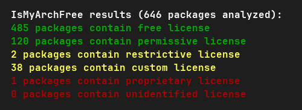

## IsMyArchFree 

IsMyArchFree is a simple program that analyzes pacman-installed packages' licenses and flags them as free, permissive, restrictive, custom, proprietary or unidentified.

## Usage:

```
git clone https://github.com/mskrd/ismyarchfree
cd ismyarchfree
chmod +x ./main
./main
```

Output example:



## Contributing:

If you encountered packages with unidentified or misidentified licenses, please submit an issue with the program's output. Alternatively you can fix it yourself and send a pull request. The part of the code where licenses are categorized is lines 31-52 of main.c. Thanks!